# 🎓 ReservaUD — Sistema de Reserva de Recursos Universitarios

Aplicación web fullstack para la reserva de recursos académicos (laboratorios, aulas, tabletas, portátiles y video beams) de una universidad. Permite registrar usuarios, autenticarse con JWT, consultar la disponibilidad por franjas horarias, reservar, cancelar y calificar el servicio, todo con roles (`USER` / `ADMIN`), un **panel de administración con métricas y gráficas**, búsqueda avanzada de recursos, API REST documentada con Swagger, migraciones de base de datos con Flyway y despliegue reproducible con Docker Compose.

<p align="center">
  
  
  
  
  
  
  
  
  
  
  
  
</p>

---

## 🧱 Stack tecnológico

| Capa | Tecnologías |
|------|-------------|
| **Frontend** | React 19, TypeScript, Vite, React Router, React Query, React Hook Form + Zod, Axios, Recharts |
| **Backend** | Java 17, Spring Boot 3.2.5, Spring Security, Spring Data JPA, Flyway, springdoc-openapi |
| **Base de datos** | MySQL 8 |
| **Calidad** | JUnit 5, Mockito, Testcontainers, Vitest, Testing Library, oxlint |
| **Infraestructura** | Docker, Docker Compose, Nginx |

---

## 🏗️ Arquitectura

```
                        ┌──────────────────────────────┐
                        │         Navegador            │
                        │  React + TypeScript (Vite)   │
                        └──────────────┬───────────────┘
                                       │ HTTP/JSON (JWT Bearer)
                                       ▼
                        ┌──────────────────────────────┐
                        │  Frontend en producción      │
                        │  Nginx (servidor estático)   │
                        │  :80                         │
                        └──────────────┬───────────────┘
                                       │
                                       ▼
        ┌───────────────────────────────────────────────┐
        │              Backend — Spring Boot            │
        │  Controller → Service → Repository → Entity   │
        │  Spring Security + JWT  ·  DTOs  ·  Flyway     │
        │  @ControllerAdvice (errores JSON)  ·  :8080    │
        └──────────────────────────┬────────────────────┘
                                   │ JPA
                                   ▼
                        ┌──────────────────────────────┐
                        │         MySQL 8 :3306         │
                        │  Migraciones Flyway (V1-V3)   │
                        └──────────────────────────────┘
```

Flujo de una reserva: el usuario consulta disponibilidad (`POST /recursos/disponibilidad`), crea la reserva (`POST /reservas`), y una tarea programada (`@Scheduled`) transiciona los estados automáticamente (`reservado → en progreso → finalizado`). El token JWT incluye el rol como *claim*, por lo que la autorización de cada request es **stateless**.

---

## ✨ Funcionalidades

- Registro e inicio de sesión con validación (React Hook Form + Zod) y token JWT.
- Roles persistidos en BD (`ROLE_USER` / `ROLE_ADMIN`) verificados en cada request.
- Listado paginado y ordenable de recursos con calificación promedio y características.
- **Búsqueda avanzada**: búsqueda por nombre (con *debounce*), filtro por tipo de recurso, filtro por disponibilidad en una fecha y orden por calificación (todo server-side).
- Consulta de disponibilidad por fecha y franja horaria (slots de 1 hora).
- Reserva, cancelación (con antelación mínima de 2 h) y calificación (1–5) de reservas propias.
- Historial de reservas con estados y acciones contextuales.
- **Panel de administración** (`ROLE_ADMIN`): dashboard con métricas y gráficas, CRUD de recursos y tipos, gestión de disponibilidades y vista de todas las reservas.
- Manejo uniforme de errores HTTP (400/401/403/404) con cuerpo JSON.
- Documentación interactiva de la API con Swagger.
- Migraciones de esquema y *seed* automáticos con Flyway.
- Tests de integración (Testcontainers) y unitarios (Mockito) en el backend; tests de componentes (Vitest + Testing Library) en el frontend.

---

## 🛠️ Panel de administración

Accesible con `admin / 123456` (ROLE_ADMIN). Incluye:

| Sección | Funcionalidad |
|---------|---------------|
| **Dashboard** | Métricas (recursos, tipos, usuarios, reservas por estado) y gráficas con Recharts: reservas por día (barras), recursos más reservados (circular) y horas pico por hora del día (heatmap) |
| **Recursos** | CRUD de recursos (crear, editar, eliminar) |
| **Tipos** | CRUD de tipos de recurso |
| **Disponibilidades** | Asignar disponibilidad por recurso y fecha (rango horario → slots de 1 h), con validación de franjas pasadas o ya reservadas, y vista resumida de horarios por día |
| **Reservas** | Ver todas las reservas del sistema (paginado) |

---

## 📸 Capturas de pantalla

| Inicio | Recursos |
|--------|----------|
| 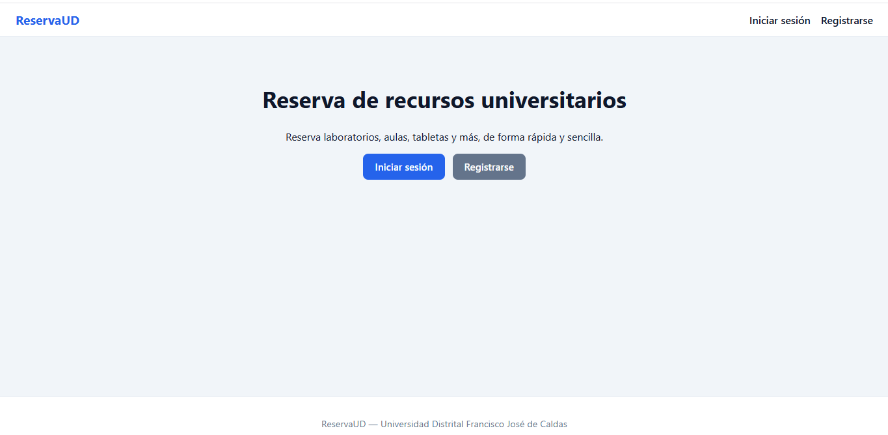 | 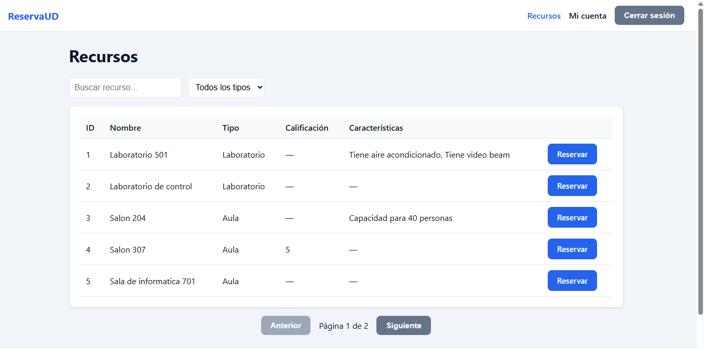 |

| Reserva | Mi cuenta |
|---------|-----------|
| 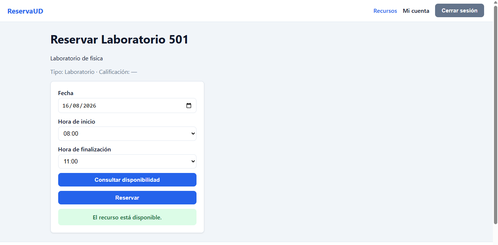 | 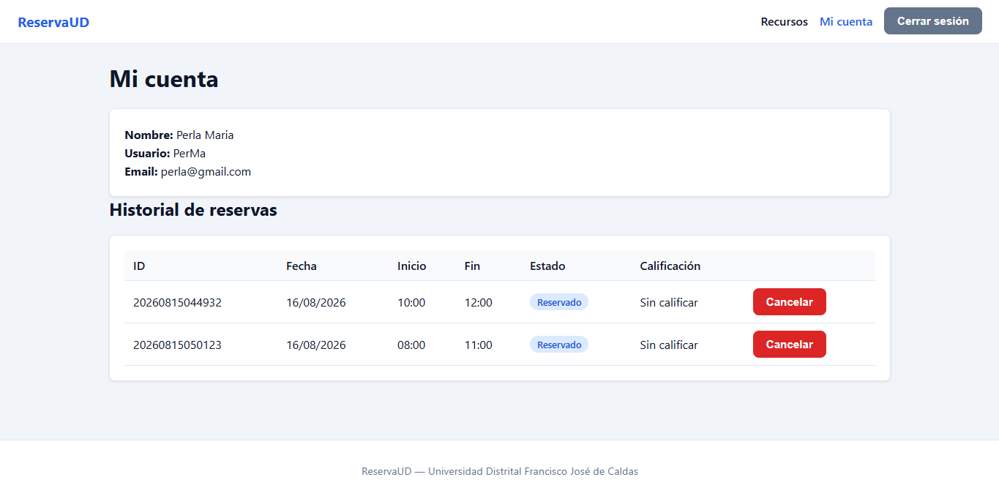 |

| Panel admin — Dashboard |
|-------------------------|
| 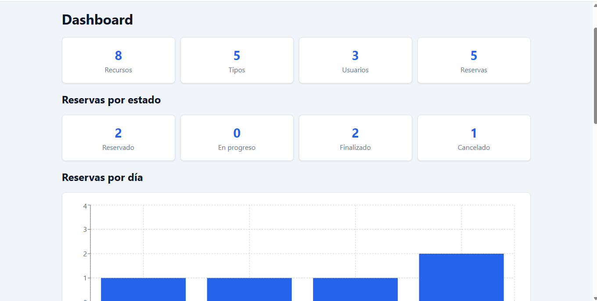 | 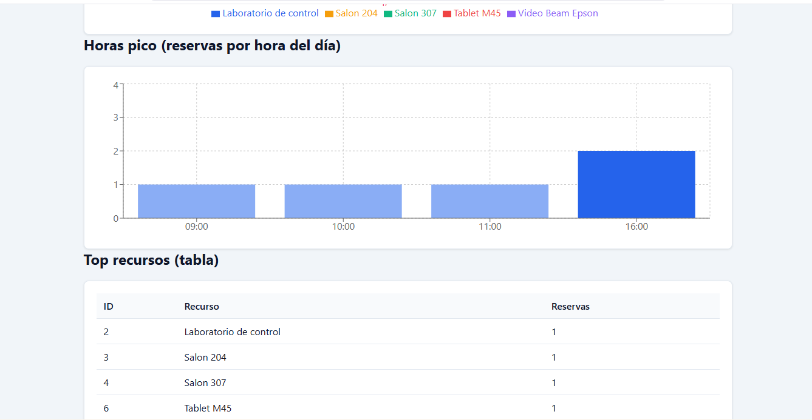 |

| Admin — Recursos | Admin - Crear/Editar Recurso |
|------------------|------------------------------|
| 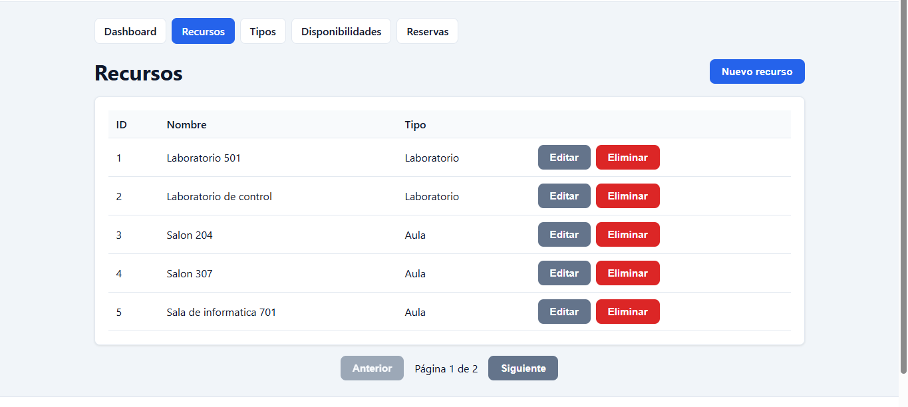 | 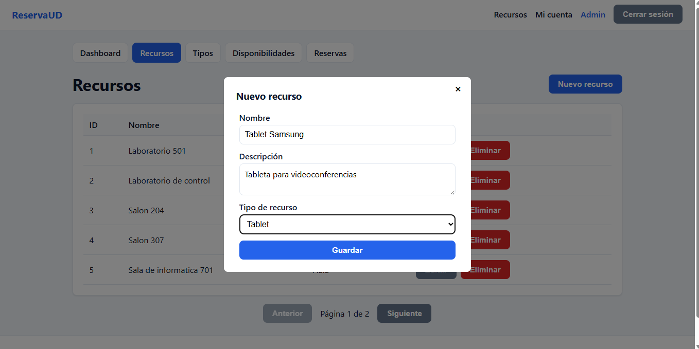 |

| Admin — Tipos | Admin - Crear/Editar Tipos |
|---------------|----------------------------|
| 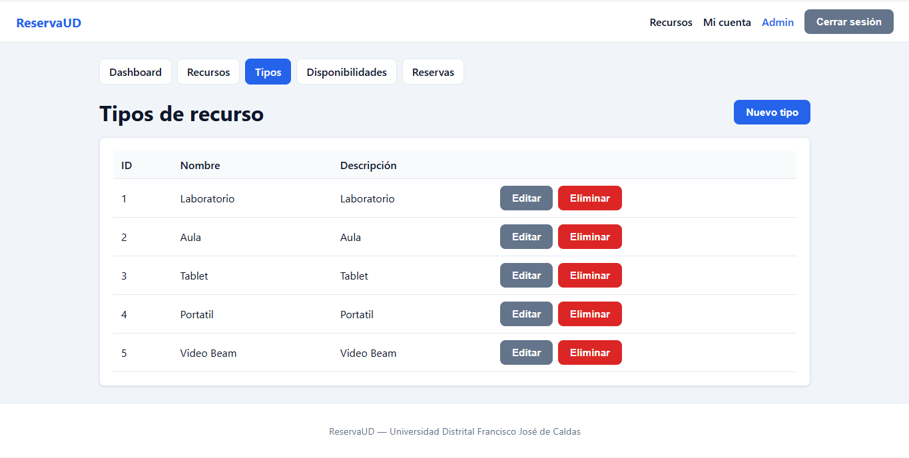 | 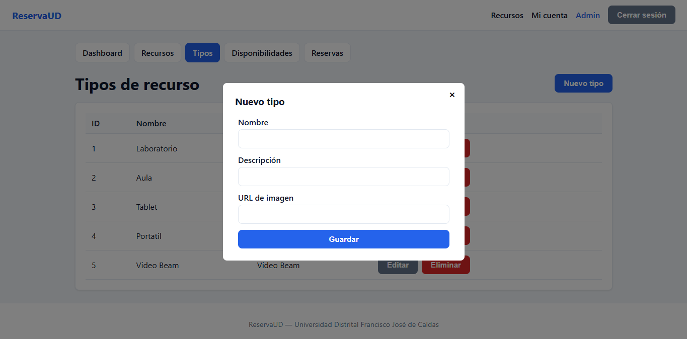 |

| Admin — Disponibilidades | Admin - Crear Disponibilidad |
|--------------------------|------------------------------|
| 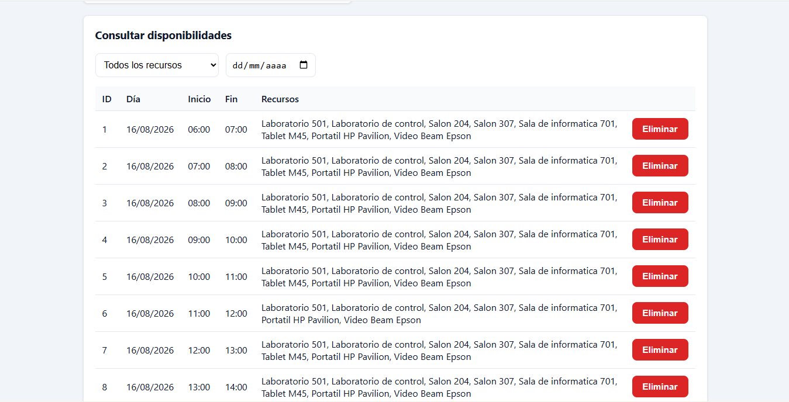 | 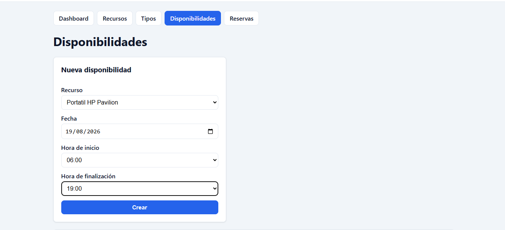 |

| Admin — Reservas Sistema |
|--------------------------|
| 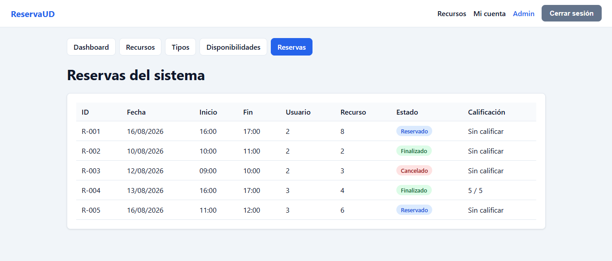 |
---

## 🚀 Cómo ejecutar el proyecto

> Requisito: **Docker** con integración WSL activada.

```bash
# 1. Configurar variables de entorno
cp .env.example .env

# 2. Construir y levantar MySQL + backend + frontend
docker compose up --build

# 3. Abrir la aplicación
#    Frontend:  http://localhost
#    API:       http://localhost:8080
#    Swagger:   http://localhost:8080/swagger-ui.html
```

Para detener: `docker compose down` (agrega `-v` para borrar también los datos).

### Desarrollo local (sin Docker)

```bash
# Backend (MySQL local + Flyway automático)
cd backend && cp .env.example .env && ./mvnw spring-boot:run

# Frontend
cd frontend && npm install && npm run dev   # http://localhost:5173
```

**Usuarios sembrados** por el seed de Flyway: `admin / 123456` (ROLE_ADMIN) y `user / 123456` (ROLE_USER).

---

## 📡 API REST

Documentación interactiva en **Swagger**: `http://localhost:8080/swagger-ui.html` (spec en `/v3/api-docs`).

Formato de error uniforme: `{ "message": "...", "status": <código> }`.

| Método | Endpoint | Descripción | Auth |
|--------|----------|-------------|------|
| `POST` | `/auth/register` | Registrar usuario | — |
| `POST` | `/auth/login-user` | Login → token JWT | — |
| `GET` | `/recursos` | Recursos paginados y filtrables: `?q=&tipo=&disponible=YYYY-MM-DD&sort=` | Bearer |
| `GET` | `/recursos/{id}` | Detalle de recurso | Bearer |
| `GET` | `/recursos/tipo/{id}` | Recursos por tipo | Bearer |
| `POST` | `/recursos/disponibilidad` | Consultar disponibilidad | Bearer |
| `GET` | `/tipos` | Tipos de recurso (paginado) | Bearer |
| `GET` | `/tipos/{id}` | Detalle de tipo | Bearer |
| `GET` | `/usuarios/{id}` | Perfil e historial (solo propio) | Auth |
| `POST` | `/reservas` | Crear reserva | `ROLE_USER` |
| `PATCH` | `/reservas/{id}/cancelar` | Cancelar reserva propia | `ROLE_USER` |
| `PATCH` | `/reservas/{id}/calificar` | Calificar reserva finalizada | `ROLE_USER` |
| `GET` | `/admin/dashboard` | Métricas y datos para gráficas | `ROLE_ADMIN` |
| `GET/POST` | `/admin/recursos` · `/admin/recursos/{id}` (`PUT/DELETE`) | CRUD de recursos | `ROLE_ADMIN` |
| `GET/POST` | `/admin/tipos` · `/admin/tipos/{id}` (`PUT/DELETE`) | CRUD de tipos | `ROLE_ADMIN` |
| `GET/POST/DELETE` | `/admin/disponibilidades` | Gestionar disponibilidades | `ROLE_ADMIN` |
| `GET` | `/admin/reservas` | Todas las reservas (paginado) | `ROLE_ADMIN` |

Colección de pruebas incluida: `postman/ReservaUD.postman_collection.json` (importable en Postman).

---

## 🧪 Testing

```bash
# Frontend (Vitest + Testing Library)
cd frontend && npm test

# Backend (requiere Docker para Testcontainers)
cd backend && ./mvnw test
```

- **Backend integración** (`AuthControllerTest`): Testcontainers levanta un MySQL real y verifica registro/login JWT y códigos de error.
- **Backend unitarios** (`ReservaServiceTest`): cancelación con antelación exacta, restauración de todos los slots, calificación y autorización.
- **Frontend** (`LoginPage`, `RecursosPage`, `StarRating`): validación de formularios, lista vacía y comportamiento de componentes.

---

## 🧠 Decisiones técnicas

- **JWT + Spring Security (stateless)**: autenticación sin sesiones en el servidor; el rol viaja como *claim* del token y se verifica en cada request, lo que permite escalar horizontalmente y desacoplar frontend/backend.
- **Roles persistidos en BD**: se almacenan en `usuario.n_role` en lugar de hardcodearlos en runtime, evitando que "nadie pueda ser admin".
- **Capa de DTOs**: los controllers nunca exponen entidades JPA. Define un contrato estable para la API, evita filtrar campos internos y desacopla la persistencia de la interfaz.
- **`LocalTime`/`LocalDate` en lugar de `java.sql.*`**: elimina bugs de zona horaria en la comparación de franjas horarias contra la BD.
- **Flyway**: esquema y datos de prueba versionados y reproducibles; el *seed* usa fechas relativas a `CURDATE()` para tener disponibilidad siempre futura.
- **React Query**: cachea listados, expone estados de carga/error y permite invalidar consultas tras una mutación (p. ej. al cancelar una reserva se refresca el historial).
- **Filtros server-side**: la búsqueda, el filtro por tipo y por disponibilidad se resuelven en el backend con `JpaSpecificationExecutor`, de modo que la paginación es correcta aunque se combine con filtros; el orden por calificación se calcula a partir del promedio de reservas finalizadas.
- **Recharts**: gráficas en el dashboard a partir de agregaciones SQL (reservas por día, por hora y por recurso).
- **React Hook Form + Zod**: validación de formularios declarativa y tipada, con el mismo esquema como fuente de verdad.
- **`@ControllerAdvice`**: errores de negocio tipados que se traducen en respuestas JSON uniformes (400/403/404) en lugar de strings sueltos.
- **Testcontainers**: tests de integración contra un MySQL real y desechable, sin depender del entorno local.
- **Docker Compose**: entorno reproducible de un solo comando para revisores y reclutadores.

---

## 📁 Estructura del proyecto

```
ReservaUD/
├── backend/                      # API REST (Spring Boot)
│   ├── src/main/java/com/api/backend/
│   │   ├── controller/           # Endpoints REST (solo DTOs)
│   │   ├── service/              # Lógica de negocio
│   │   ├── repository/           # Spring Data JPA
│   │   ├── dto/request|response/ # Capa de DTOs
│   │   ├── exception/            # Excepciones + @ControllerAdvice
│   │   ├── security/             # Filtro JWT y configuración
│   │   ├── config/               # CORS y beans
│   │   ├── model/                # Entidades JPA
│   │   └── sheduled/             # Tareas programadas
│   └── src/main/resources/db/migration/   # Flyway (V1-V3)
├── frontend/                     # SPA (React + Vite + TS)
│   └── src/
│       ├── api/                  # Cliente Axios + interceptor JWT
│       ├── components/           # UI y layout (incl. AdminLayout)
│       ├── pages/                # Vistas (usuario + admin/)
│       ├── hooks/                # useAuth, useRecursos, useReservas, useAdmin
│       ├── contexts/             # AuthContext
│       ├── types/                # Tipos compartidos
│       └── utils/                # Formatters y constantes
├── postman/                      # Colección de pruebas de la API
├── docker-compose.yml            # MySQL + backend + frontend
└── docs/screenshots/             # Capturas para el README
```

---

